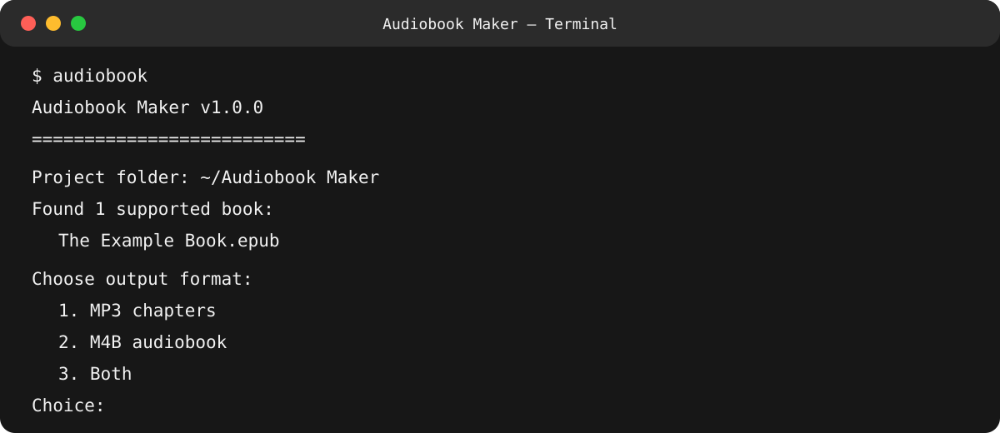

# Audiobook Maker

Audiobook Maker is an accessible macOS command-line application that converts DRM-free PDF, TXT, DOCX, and EPUB books into chaptered MP3 audiobooks, single-file M4B audiobooks, or both.

It is designed for keyboard and VoiceOver use.

## Terminal preview

## Main features

- Converts PDF, TXT, DOCX, and DRM-free EPUB books.

- Creates separately tagged MP3 chapters, one chaptered M4B, or both.

- Embeds chapters, title, author, narrator, cover art, and other metadata.

- Reviews front matter and suggests titles and authors before conversion.

- Uses EPUB artwork, companion images, PDF first-page artwork, or suitable DOCX images when available.

- Estimates audiobook duration and verifies completed audio.

- Produces a conversion report for each book.

- Provides spoken and macOS completion notifications.

- Lets users keep, archive, uniquely rename, or move successfully converted originals to the Bin.

- Protects existing output and source books when conversion fails or is cancelled.

- Lets users choose where the Audiobook Maker project folder is stored.

## Requirements

Audiobook Maker currently supports macOS.

It requires:

- Python 3.9 or newer;

- ffmpeg and ffprobe;

- Poppler, including `pdftotext`;

- the Python packages declared in `pyproject.toml`.

Speech and desktop notifications use the built-in macOS `say` and `osascript` commands.

## Installation

Install the required system tools with Homebrew:

    brew install python ffmpeg poppler

Install Audiobook Maker from a local checkout:

    git clone https://github.com/sitinox/audiobook-maker.git

    cd audiobook-maker

    python3 -m venv .venv

    source .venv/bin/activate

    python -m pip install .

Run it with:

    audiobook

## Basic use

1. Run `audiobook`.

2. Choose or confirm the project folder when prompted.

3. Put a DRM-free PDF, TXT, DOCX, or EPUB book in its `Books to Convert` folder.

4. Run `audiobook` again.

5. Follow the spoken and written prompts.

Audiobook Maker guides you through output format, voice, speech rate, bitrate, title, author, front matter, and original-file handling.

Useful commands:

    audiobook --help

    audiobook --settings

    audiobook --changelog

    audiobook --version

## Supported formats

### Input

- PDF

- TXT

- DOCX

- DRM-free EPUB

### Output

**MP3:** a folder containing separately tagged chapter files.

**M4B:** one audiobook containing embedded chapter markers and metadata.

**Both:** an M4B audiobook plus MP3 chapters in an `MP3` subfolder.

## Cover art

Audiobook Maker can use:

- artwork stored inside an EPUB;

- a companion image with the same filename as the source book;

- suitable artwork from the first page of a PDF;

- a suitable early embedded image from a DOCX file.

Companion artwork takes priority over automatically detected artwork. Books without usable artwork can still be converted.

## Accessibility

Audiobook Maker was developed for keyboard and VoiceOver use.

Prompts are written to Terminal and spoken aloud. Choices can be repeated by typing `r`, and completion is announced with speech and a macOS notification.

The interface avoids requiring mouse interaction and keeps important progress and error information available as Terminal text.

## File safety

Audiobook Maker stages new MP3 and M4B output before replacing existing files. Failed or cancelled conversions do not publish partial output or trigger handling of the original source book.

Settings are written atomically, damaged settings files are preserved for inspection, and temporary conversion files are cleaned after successful, failed, and cancelled operations.

## Current limitations

- Audiobook Maker is macOS-only.

- It does not remove or bypass DRM.

- PDF chapter detection depends on the structure and quality of extracted text.

- Scanned image-only PDFs require OCR before conversion.

- Unusually structured books may need manual chapter or front-matter decisions.

- Speech generation depends on voices supplied by macOS.

## Documentation

- [Development and contribution guidance](CONTRIBUTING.md)

- [Release history](CHANGELOG.md)

- [Licence](LICENSE)

- [Bugs and feature requests](https://github.com/sitinox/audiobook-maker/issues)

## Licence

Audiobook Maker is free software licensed under the GNU General Public License version 3 or any later version.
